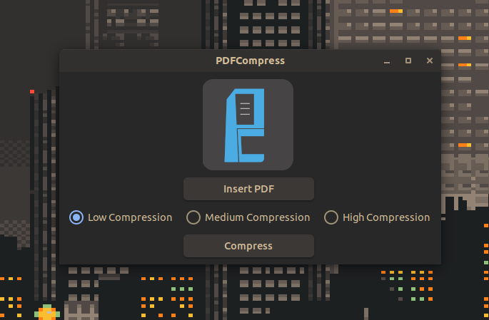

# PDFCompress

This is a GUI Frontend for the terminal utility called ghostscript. 



### How to run this program:

```bash
git clone https://github.com/Haardipro/PDFCompress
```

```bash
sudo apt install python3-gi python3-gi-cairo gir1.2-gtk-3.0
```

After that cd into the PDFCompress direcory, then run main.py

```bash
cd PDFCompress/
python3 main.py
```

### Stuff left to add:

- [x] Name of selected pdf on the insert pdf button or on a different label

- [x] Opening the directory of the compressed file after compression

- [ ] Converting the application to GTK4
